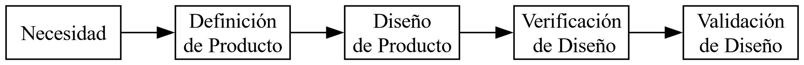
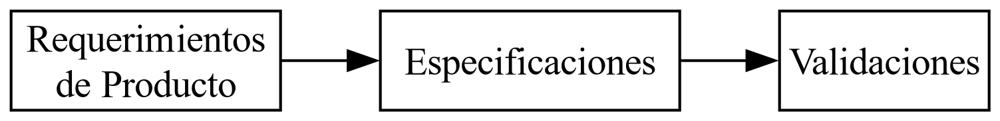
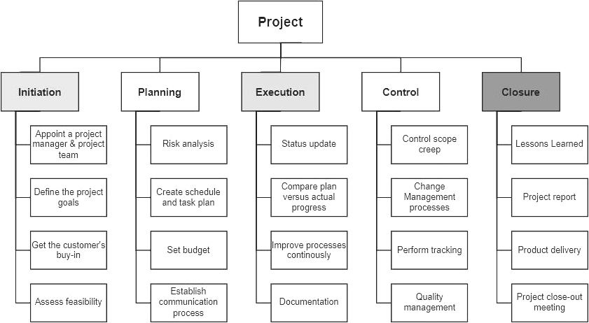

# Planificación de Proyectos

\tableofcontents

## Proceso de Diseño

El diseño de ingeniería se vincula con la concepción de sistemas, equipos,
componentes o procesos con el fin de satisfacer una necesidad

Un proyecto de ingeniería es definido como: "Un proceso único consistente en un
conjunto de actividades coordinadas y controladas, con fechas establecidas de
inicio y finalización, desarrolladas con el fin de alcanzar un objetivo para
conformar requerimientos específicos, incluyendo restricciones de tiempo, costo
y recursos".

Las tareas involucradas y su desarrollo reúnan las siguientes condiciones:

* Ser único
* Ser complejo
* Cumplir con una organización temporaria/un plan preestablecido
* Tener objetivos relacionados con la satisfacción de las necesidades
* Satisfacer requerimientos específicos:
    - Tiempo
    - Presupuesto
    - Beneficio
    - Recursos

La salida debe resultar de un proceso de optimización del diseño, buscando
simplificar, mejorar, innovar, y reducir desperdicios, valiéndose de
herramientas específicas tales como:

* La función de despliegue de la calidad (QFD)
* Análisis de los modos de falla (FMEAs)
* Análisis del árbol de fallas (FTA)
* Diseño de experimentos (DOE)
* Análisis de ingeniería del valor (VE)
* Análisis de tolerancias (DOT)
* Análisis de costo/desempeño/riesgo

### Determinación de la necesidad

El proceso de diseño parte del reconocimiento de una necesidad insatisfecha, mal
satisfecha, o susceptible de mejorar en algún sentido. Las necesidades resultan
o surgen por motivaciones muy variadas:
* Investigaciones de mercado, que muestran que los productos actuales han
  quedado obsoletos, o fuera de competencia
* Aparición de nuevas legislaciones, normativas o demandas.
* Complementos de productos, por análisis de un mercado ya existente.
* Nuevas posibilidades que surgen durante la ejecución de otro proyecto
* Pedidos formales, donde el cliente formula directamente el requerimiento
* Pedidos informales, en donde un potencial cliente sugiere que una determinada
  propuesta, en un área de interés particular, tendría gran aceptación o grandes
  posibilidades futuras.
* Nichos de mercado insatisfechos de productos existentes.

### Definición de producto

Los requerimientos son las necesidades, funcionalidades o condiciones que un
sistema, producto o proyecto debe cumplir para satisfacer los objetivos. Los
requerimientos se pueden dividir en funcionales y no funcionales, los
funcionales describen qué debe hacer el sistema, por ejemplo: "El sistema debe
permitir al usuario crear una cuenta", mientras que los no funcionales
describen como se debe comportar el sistema, o que características de calidad
debe tener, por ejemplo "El sistema debe responder en menos de 2 segundos".

Los requerimientos son la base de las especificaciones, la cual es una
descripción detallada, clara y precisa de cómo debe ser el producto, sistema o
componente para cumplir con los requerimientos definidos.

#### Especificaciones técnicas

Detallan los aspectos funcionales, mecánicos, eléctricos, de software, etc.
Ejemplo: "El sistema debe usar una base de datos PostgreSQL y soportar hasta
1000 usuarios concurrentes."

#### Especificaciones funcionales

Describen lo que el sistema debe hacer. Ejemplo: "El sistema debe permitir
registrar nuevos usuarios mediante un formulario web."

#### Especificaciones de diseño

Incluyen planos, diagramas, prototipos o interfaces. Ejemplo: un wireframe de
una aplicación móvil.

#### Especificaciones de producto o fabricación

Usadas en ingeniería o industria. Ejemplo: materiales, dimensiones, tolerancias,
procesos.

### Diseño detallado

El propósito de esta etapa del proyecto es:

* Seleccionar los circuitos
* Establecer modelos para el cálculo de los elementos, a fin de determinar la
  carga a la que se ven sometidos
* Seleccionar los componentes estándar en función de la carga a la que están
  sometidos, indicando fabricante y número de parte correspondiente
* Establecer las especificaciones que deben ser satisfechas por los componente a
  medida
* Realizar análisis de valor de cada elemento
* Documentar los problemas detectados en las etapas de verificación, y las
  acciones de corrección correspondientes
* Documentar los resultados de los ensayos de validación efectuados sobre
  prototipos
* Generar la documentación y las especificaciones que describan completamente el
  diseño, etc

## Pensamiento de Diseño (Design Thinking)

El pensamiento de diseño es una metodología que se aplica en el diseño de
productos, esta metodología esta centrada en las personas, ya que se basa en
entender las necesidades del usuario, generando ideas, prototipando soluciones y
probándolas corrigiéndolas y volviendo a empezar, esto ultimo notando el
comportamiento iterativo de la metodología.

### Etapas del pensamiento de diseño

Principalmente, el pensamiento de diseño se estructura en 5 fases

1. Empatizar
2. Definir
3. Idear
4. Prototipar
5. Evaluar

#### Empatizar

Durante esta etapa se busca comprender al usuario, para esto se puede seguir la
regla *observar-escuchar-involucrarse*.

##### Mapas de Empatía

Es una herramienta que ayuda a sintetizar la información obtenida del usuario
(en etapas previas, como entrevistas, o mediante observación, etc) de manera tal
que resulte mas fácil identificar descubrimientos claves (insights) que no se
obtienen solo con datos.

La estructura típica de un mapa de empatía es:

1. Dice
2. Piensa
3. Siente
4. Hace
5. Esfuerzos
6. Necesidades

#### Definir

Se sintetiza la información para formular un problema claro y bien enfocado,
basado en las necesidades detectadas en etapas anteriores.

##### POV Statement

Un POV Statement (Point of View Statement) es una declaración clara del problema
desde la perspectiva del usuario, que ayuda a enfocar la ideación en una
necesidad humana específica.

La estructura tipica de un POV Statement es `<usuario> necesita <necesidad>
porque <insight>`, por ejemplo en el contexto del sistema de acceso al
estacionamiento desde el punto de vista del operador de sistema: "el operador
**necesita** registrar vehículos de forma rápida y sin cometer errores,
**porque** debe atender a varios usuarios en poco tiempo y asegurarse de que la
información esté bien cargada**.

#### Idear

El propósito principal de la etapa de idear es generar soluciones creativas al
problema definido a partir de los hallazgos de las fases anteriores, existen
muchas dinámicas para generar ideas, como por ejemplo brainstorming, SCAMPER,
entre otras

##### Brainstorming

El brainstorming es una herramienta dinámica grupal (o individual) para
generar una gran cantidad de ideas sin juzgarlas, con el fin de explorar todas
las posibles soluciones a un reto o necesidad del usuario.

#### Prototipar

Durante esta etapa se convierten las ideas seleccionadas de la etapa anterior en
soluciones tangibles y experimentales con las cuales el usuario pueda
interactuar, de esta forma detectando posibles fallas, oportunidades o
malentendidos.

Algunas formas de prototipar incluyen realizar bocetos, maquetas, videos
simulados, entre otras.

#### Evaluar

Durante la etapa de testeo o evaluación se ponen a prueba las soluciones
prototipadas con los usuarios para ver si realmente satisfacen sus necesidades,
resuelven sus problemas y generan valor.

Con la información obtenida durante esta etapa se puede decidir si volver a
etapas anteriores, o rediseñar el prototipo de alguna manera, y en caso de hacer
cambios importante repetir la etapa de evaluación.

## Work Breakdown Structure (WBS)

Se debe tener definido el propósito, el objetivo y el alcance del proyecto. El
propósito, es la razón de ser o el significado más profundo del proyecto. El
objetivo es la meta concreta y tangible que se busca alcanzar, basada en el
propósito y el alcance se define los límites y fronteras del proyecto, es la
suma de todos los requerimientos y las restricciones.

En un WBS o EDT (Estructura de Desglose del Trabajo, en español) se plasma el
alcance y los requerimientos del proyecto, para esto se divide la totalidad del
proyecto en actividades intermedias únicas.

Los niveles del WBS representan el grado de detalle o descomposición del
proyecto en partes más manejables, cuanto mayor sea el nivel mayor será la
especificidad de la tarea o actividad. Por lo general las actividades de un WBS
se eligen de manera tal que no ocupan mas de 80 horas de trabajo por persona

## Activity on Node (AON)

En el AON se muestran todas las actividades necesarias para completar el
proyecto en un diagrama de nodos y flechas, de manera que se pueda ver las
dependencias de cada actividad y se pueda estimar tiempos.

Para estimar tiempos en un diagrama AON, se asigna una duración estimada a cada
actividad representada por los nodos, esto puede ser mediante expertos en el
area o si se ha realizado proyectos similares antiguamente o bien mediante la
técnica PERT (la cual es similar a un promedio ponderado); luego de la
estimación de tiempos se analiza la secuencia de actividades para calcular la
duración total del proyecto, así como identificar el camino crítico.

El camino critico es el camino de actividades que de retrasarse, se retrasa todo
el proyecto, es el de mayor duración, o de holgura nula. La holgura es el tiempo
que puede retrasarse (en iniciar o finalizar) sin que se retrasen otras
actividades dependientes de esa.

### Técnica CPM

La técnica Critical Path Method (CPM) es un método de estimación y gestión de
tiempos que se utiliza para planificar, programar y controlar proyectos. Es
útil cuando se tiene la duración estimada de cada actividad y se necesita
encontrar la secuencia de tareas críticas para completar el proyecto en el menor
tiempo posible. Se realiza un gráfico de nodos y flechas con cada una de las
actividades del proyecto contemplando las dependencias jerárquicas y temporales

El tiempo mas temprano de un nodo es el instante más inmediato en el cual puede
ocurrir el evento correspondiente a dicho nodo. El tiempo más tarde para un nodo
es el último instante en el cual puede ocurrir el evento correspondiente al nodo
sin retrasar la duración total del proyecto.

La diferencia entre el tiempo más tardío y el tiempo más temprano se define
como holgura.

Una actividad crítica es una actividad que no puede retrasarse. Si se retrasa
afecta a la duración total del proyecto. En otras palabras, el tiempo más
temprano y el tiempo más tarde de inicio de la actividad son idénticos, es
decir, tiene tiempo de holgura nulo.

### Técnica de estimación de tiempos PERT

La técnica PERT (Program Evaluation and Review Technique) es una herramienta de
planificación utilizada para estimar la duración de actividades en proyectos,
especialmente cuando hay incertidumbre en los tiempos, esto puede ocurrir cuando
no se conoce con certeza cuánto tiempo tomará la actividad, por ejemplo en
investigaciones o desarrollos nuevos.

Es una formula probabilística que permite obtener una estimación de tiempo mas
real a partir de 3 tiempos estimados de una actividad: el tiempo optimista
($O$), el mas probable ($M$) y el tiempo pesimista ($P$).

$$T_{e} = \frac{O + 4*M + P}{6}$$

El calculo de la varianza de cada actividad se utiliza para determinar la
incertidumbre de que se termine el proyecto de acuerdo al programa.

$$Varianza = {\sigma}^2 = \left({\frac{P - O}{6}}\right) ^2$$

## Metodologías Ágiles

La metodología ágil es un enfoque flexible para la gestión de proyectos que se
centra en la colaboración, la comunicación y la entrega de valor de manera
iterativa y continua. En lugar de planificar exhaustivamente al inicio, las
metodologías ágiles permiten adaptarse a los cambios en los requisitos y
prioridades a lo largo del proyecto

### Metodología Scrum

Es una forma de organizar el trabajo en equipo en ciclos cortos y repetitivos
llamados Sprints, con el objetivo de entregar valor rápidamente, adaptarse a
cambios y mejorar continuamente.

#### Roles en Scrum

* Product Owner (Dueño del Producto): Representa al cliente y prioriza el
  trabajo (Product Backlog).
* Scrum Master: Facilita el proceso Scrum, elimina obstáculos y guía al equipo.
  Hace de intermediario entre el Product Owner y el equipo de desarrollo,
  facilitando la comunicación.
* Equipo de desarrollo: Grupo auto-organizado que lleva a cabo el trabajo
  técnico y el desarrollo concreto y tangible del proyecto.

#### Product Backlog

El Product Backlog es una lista ordenada de todo lo que se necesita hacer para
desarrollar el producto. Es la fuente única de requisitos para cualquier cambio
que se necesite en el producto. El Product Owner se encarga de crear y
mantenerlo, de asignar las prioridades a cada item en funciona del valor de
negocio y de asegurarse de que este bien claro y comprendido. El product backlog
se actualiza de manera continua, por ejemplo al terminar un sprint o cuando
cambian las necesidades de los usuarios.

Los items pueden ser historias de usuario, los cuales son una forma ágil y
centrada en el usuario de describir requisitos funcionales.

#### Historias de Usuario

Las historias de usuario son una forma de describir lo que el usuario
necesita de manera simple, clara y centrada en el valor que aportará esa
funcionalidad o característica.

El formato mas común de historia de usuario es `Como <usuario> quiero <lo que
desea> para <beneficio o valor>`. Por ejemplo en el sistema de acceso al
estacionamiento: "**Como** operador del sistema, **quiero** poder registrar los
datos del vehículo al ingresar, **para** llevar un control preciso de los
accesos."

Para crear historias de usuario de manera efectiva se puede seguir la regla de
las 3 Cs: Card-Conversation-Confirmation (tarjeta, conversación, confirmación) 

* Card: cada historia de usuario se reduce hasta hacerla fácil de memorizar y de
  sintetizar en una tarjeta. La tarjeta sirve como recordatorio y promesa de una
  conversación posterior y no debe ser un documento completo.
* Conversation: el equipo de desarrollo y el propietario del producto añaden
  criterios de aceptación a cada historia poco antes de su implementación. Los
  cambios son bienvenidos en agilidad, por lo que no tiene sentido profundizar
  en estos detalles antes. La situación puede variar mucho desde el momento en
  el que se sintetiza la funcionalidad en la tarjeta hasta que se implementa.
* Confirmation: el product owner o usuario de negocio confirma que el equipo de
  desarrollo ha entendido y aplicado correctamente sus requisitos revisando los
  criterios de aceptación. A veces se pueden presentar transformados en
  escenarios de pruebas.

#### Temas, Épicas y Tareas

* Epic: es una historia de usuario de gran tamaño o alta granularidad, y que
  tiene por tanto un mayor grado de incertidumbre. Marcar una historia como epic
  implica que no puede completarse de una sola vez o en un único sprint. Lo
  normal es que el equipo de desarrollo lo descomponga cuando se acerque el
  momento de su implementación. Las historias de usuario resultantes estarán
  íntimamente relacionadas y su menor tamaño permitirá gestionarlas de forma
  ágil, estimando mejor el tiempo requerido para completarlas y siguiendo su
  avance con detalle.
* Tema: una colección de epics e historias de usuario relacionadas que describen
  un sistema o subsistema. Se trata de un elemento que forma parte de la visión
  del producto, más que una funcionalidad. Por ejemplo: en un sistema de
  software para gestión contable, el conjunto de epics «altas, bajas y
  mantenimiento de clientes», «facturaciones puntuales y recurrentes»,
  «consultas de navegación y acciones de fidelización», «pedidos»
  y«devoluciones» se podrían denominar como el tema de la «gestión de clientes».
* Tareas: están por debajo de las historias de usuario. Describen cómo construir
  en lugar de qué. Resultan de la descomposición de las historias de usuario en
  unidades de trabajo adecuadas pare gestionar y seguir el avance de su
  ejecución.

#### Sprint Backlog

El sprint backlog lo crea el equipo de desarrollo previo a la ejecución de un
sprint (sprint planning) teniendo en cuenta las prioridades del product backlog
y es el conjunto de item a desarrollar durante el sprint siguiente.

#### Incremento

Producto potencialmente entregable al final de cada Sprint.

### Riesgos

Los riesgos son cualquier "evento" que altera la planificación original de
objetivos y planes del proyecto.

#### Gestión de riesgos

La gestión de riesgo implica identificar los riesgos, sus efectos y tratar de
reducir sus consecuencias. Esto **no elimina** los riesgos, pero maximiza la
chance de éxito a pesar de los problemas.

Establecer planes de contingencia para todos los riesgos implica el incremento
de costos. Debemos decidir cuáles riesgos serán mitigados en base a distintos
criterios los cuales deben ser correctamente explicados y conocidos por todos
los interesados e involucrados en el proyecto.

Para definir si se debe contar con un plan de mitigación de un riesgo se lo
puede;
- Clasificar de acuerdo a la probabilidad de ocurrencia; utilizando una métrica
  de 0 a 100% y la etiqueta agrupadora de "siempre", "frecuentemente",
  "ocasionalmente", "raramente", "nunca".
- Clasificar de forma ordinal: esto es; primero el riesgo más probable, luego el
  segundo, y así sucesivamente.
- Clasificar en forma relativa; por ejemplo, "el riesgo A es dos veces más
  probable que el riesgo B" "Siempre se debe entender el impacto del riesgo en
  el proyecto y el impacto en la calidad del proyecto"

1. Identificar los riesgos: determinar que aspectos del plan o del proyecto
   podrían cambiar.
2. Estimar las consecuencias de esos riesgos: evaluar qué podría pasar si esos
   aspectos cambian.
3. Elaborar planes para mitigar sus efectos: determinar cómo se puede proteger
   el proyecto ante los riesgos.
4. Seguir el estado de los riesgos: su probabilidad de ocurrencia, la aparición
   de nuevos riesgos, etc.
5. Informar a todos los interesados sobre los riesgos.

Para detectar cuál riesgo conviene mitigar primero se puede utilizar el "RPN";
en inglés, "Risk Priority Number". 

$$ RPN = Prob. de Ocurrencia * Factor de Severidad * (1 – Prob. de Detección)$$

Siendo "Prob. de Ocurrencia": Probabilidad que ocurra ese evento; Factor de
Severidad: Indicador del daño potencial que podría generar. (Valoración
subjetiva de 0 a 1) y Probabilidad de Detección: la probabilidad de detectar la
ocurrencia del evento con anticipación.

## Gestión Económica

La gestión económica de un proyecto busca garantizar el uso eficiente de los
recursos disponibles para cumplir con los objetivos dentro del alcance, tiempo y
costo definidos. Es parte fundamental de la triple restricción:
tiempo–alcance–costo.

La elaboración de presupuestos es una de las actividades claves en la
planificación de proyectos, ya que permite anticipar recursos, justificar
decisiones y evaluar la viabilidad.

Los costos se pueden clasificar en directo e indirectos

### Costos directos

Los costos directos son aquellos que se pueden asociar directamente con un
producto, servicio o entregable del proyecto. Por ejemplo el hardware, las
licencias de uso, los materiales para la instalación, etc.

### Costos indirectos

Los costos indirectos no se pueden asociar directamente a un entregable
particular, pero son necesarios para que el proyecto se lleve a cabo. Por
ejemplo, la mano de obra (programadores, instaladores), el mantenimiento
preventivo, los costos de gestión o administración, etc.

### Cost Breakdown Structure (CBS)

El Cost Breakdown Structure (CBS) es la organización jerárquica de los costos
del proyecto, alineada a los entregables y actividades del Work Breakdown
Structure (WBS).
